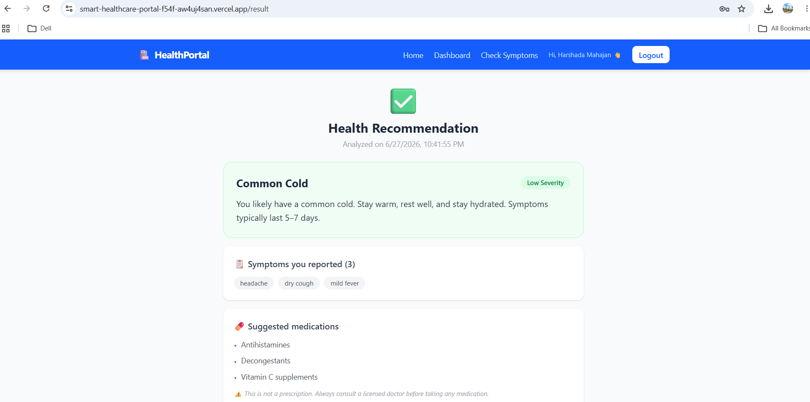
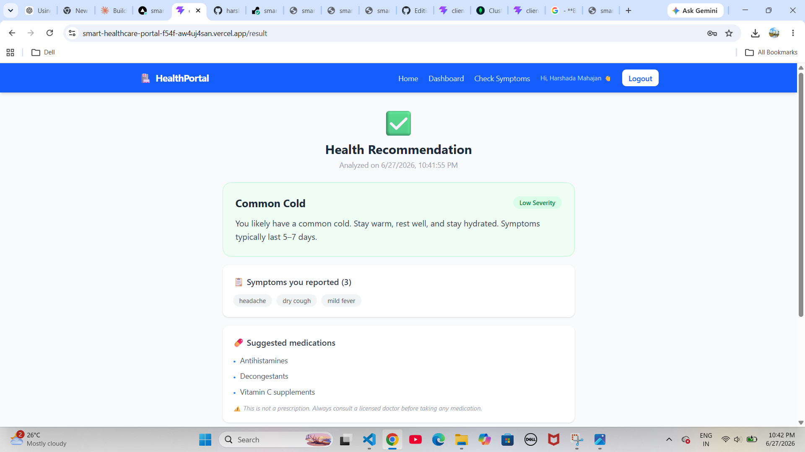

# 🏥 Smart Healthcare Portal

A full-stack MERN web application that enables users to securely manage their health information by checking symptoms, receiving intelligent health recommendations, and maintaining a personal symptom history.

---

## 🚀 Live Demo

### Frontend
https://smart-healthcare-portal-f54f-aw4uj4san.vercel.app

### Backend API
https://smart-healthcare-portal-o5w9.onrender.com/

---

## 📌 Project Overview

Smart Healthcare Portal is a modern healthcare web application built using the MERN stack. It provides a secure authentication system, an intelligent symptom analysis engine, and a personalized dashboard where users can track their symptom history.

The project demonstrates full-stack development concepts including authentication, REST APIs, MongoDB integration, protected routes, responsive UI design, and cloud deployment.

---

## ✨ Features

### Authentication
- User Registration
- User Login
- JWT Authentication
- Password Encryption using bcrypt
- Protected Routes

### Symptom Checker
- 40+ Symptoms
- 7 Symptom Categories
- Rule-based Health Recommendation Engine
- Instant Recommendation Generation

### Dashboard
- View Symptom History
- Delete Individual Records
- Refresh History
- Responsive Cards

### User Experience
- Responsive Design
- Mobile Navigation
- Skeleton Loading
- Toast Notifications
- Custom 404 Page
- Global Error Boundary

---

## 🛠 Tech Stack

### Frontend
- React
- Vite
- Tailwind CSS
- React Router DOM
- Axios

### Backend
- Node.js
- Express.js

### Database
- MongoDB Atlas
- Mongoose

### Authentication
- JWT (JSON Web Tokens)
- bcrypt

### Deployment
- Vercel (Frontend)
- Render (Backend)

## 📸 Screenshots
---







## ⚙️ Installation

### 1. Clone Repository

```bash
git clone https://github.com/your-username/smart-healthcare-portal.git

cd smart-healthcare-portal
```

---

## Backend Setup

```bash
cd server

npm install
```

Create a `.env` file inside the **server** folder.

```env
PORT=5000

MONGO_URI=your_mongodb_connection_string

JWT_SECRET=your_secret_key

JWT_EXPIRE=7d

CLIENT_URL=http://localhost:5173
```

Start the backend server.

```bash
npm run dev
```

---

## Frontend Setup

```bash
cd client

npm install
```

Create a `.env` file inside the **client** folder.

```env
VITE_API_URL=http://localhost:5000/api
```

Start the frontend.

```bash
npm run dev
```

---


## 🔐 Environment Variables

### Server

```env
PORT

MONGO_URI

JWT_SECRET

JWT_EXPIRE

CLIENT_URL
```

### Client

```env
VITE_API_URL
```

---


---

## 📈 Future Improvements

- AI-powered symptom prediction
- Doctor appointment booking
- PDF medical report generation
- Email notifications
- Multi-language support
- Dark mode
- Admin dashboard
- Medical report analytics
- Chatbot integration using OpenAI/Gemini

---

## 👩‍💻 Author

**Harshada Mahajan**

GitHub:
https://github.com/harshadaMahajan04

LinkedIn:
(Add your LinkedIn URL)

---

## 📄 License

This project is developed for educational and portfolio purposes.
